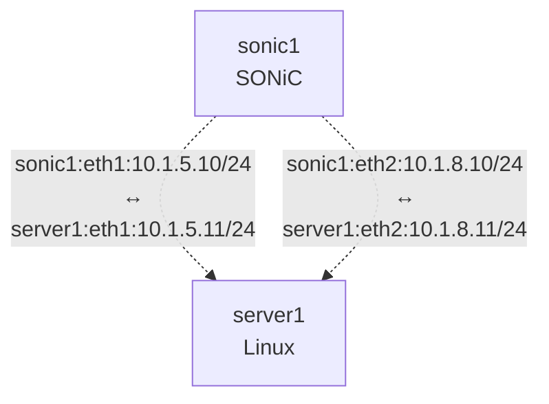

# SONiC BSAE

```mermaid
graph TB
    %% 两个节点的拓扑
    sonic1["sonic1<br/> SONiC"]
    
    server1["server1<br/>Linux"]
    
    %% SONiC和Server1链接
    sonic1 -.->|"sonic1:eth1:10.1.5.10/24<br/>↔<br/>server1:eth1:10.1.5.11/24"| server1
    sonic1 -.->|"sonic1:eth2:10.1.8.10/24<br/>↔<br/>server1:eth2:10.1.8.11/24"| server1
```

