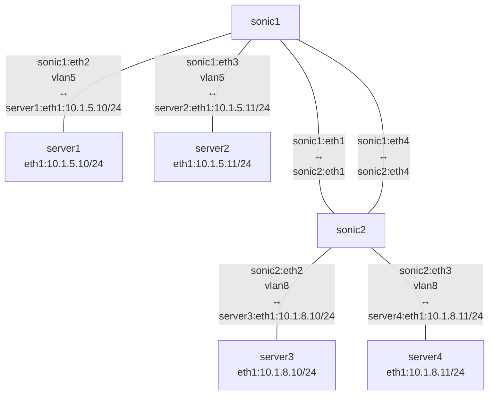

# SONiC PortChannel

```mermaid
graph TB
    %% nodes:
    sonic1["sonic1"]
    sonic2["sonic2"]

    server1["server1<br/>eth1:10.1.5.10/24"]
    server2["server2<br/>eth1:10.1.5.11/24"]
    server3["server3<br/>eth1:10.1.8.10/24"]
    server4["server4<br/>eth1:10.1.8.11/24"]

    %% links
    sonic1 ---- |"sonic1:eth1<br/>↔<br/>sonic2:eth1"| sonic2
    sonic1 ---- |"sonic1:eth4<br/>↔<br/>sonic2:eth4"| sonic2

    sonic1 --- |"sonic1:eth2<br/>vlan5<br/>↔<br/>server1:eth1:10.1.5.10/24"| server1
    sonic1 --- |"sonic1:eth3<br/>vlan5<br/>↔<br/>server2:eth1:10.1.5.11/24"| server2
    sonic2 --- |"sonic2:eth2<br/>vlan8<br/>↔<br/>server3:eth1:10.1.8.10/24"| server3
    sonic2 --- |"sonic2:eth3<br/>vlan8<br/>↔<br/>server4:eth1:10.1.8.11/24"| server4
```