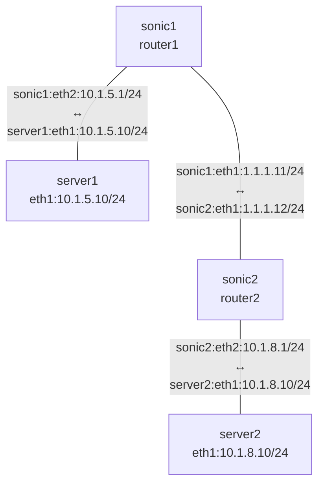

# SONiC ROUTE

```mermaid
graph TB
    sonic1["sonic1<br/>router1"]
    sonic2["sonic2<br/>router2"]

    server1["server1<br/>eth1:10.1.5.10/24"]
    server2["server2<br/>eth1:10.1.8.10/24"]

    sonic1 ---- |"sonic1:eth1:1.1.1.11/24<br/>↔<br/>sonic2:eth1:1.1.1.12/24"| sonic2
    sonic1 --- |"sonic1:eth2:10.1.5.1/24<br/>↔<br/>server1:eth1:10.1.5.10/24"| server1
    sonic2 --- |"sonic2:eth2:10.1.8.1/24<br/>↔<br/>server2:eth1:10.1.8.10/24"| server2
```

