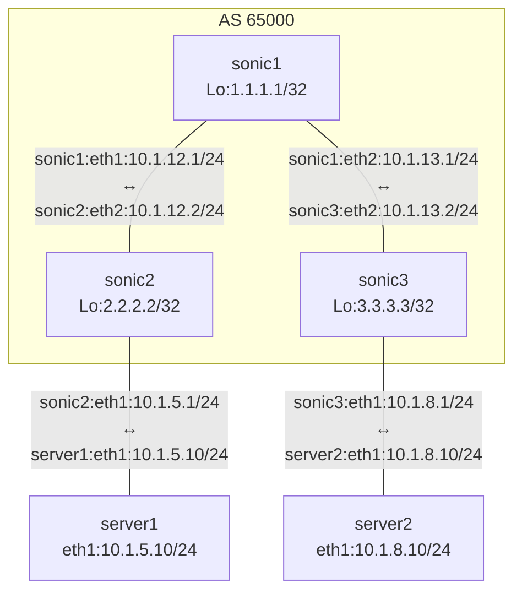

# SONiC IBGP

```mermaid
graph TB
    subgraph "AS 65000"
    sonic1["sonic1<br/>Lo:1.1.1.1/32"]
    sonic2["sonic2<br/>Lo:2.2.2.2/32"]
    sonic3["sonic3<br/>Lo:3.3.3.3/32"]
    end
    
    server1["server1<br/>eth1:10.1.5.10/24"]
    server2["server2<br/>eth1:10.1.8.10/24"]
    
    %% 
    sonic1 --- |"sonic1:eth1:10.1.12.1/24<br/>↔<br/>sonic2:eth2:10.1.12.2/24"| sonic2
    sonic1 --- |"sonic1:eth2:10.1.13.1/24<br/>↔<br/>sonic3:eth2:10.1.13.2/24"| sonic3
    sonic2 --- |"sonic2:eth1:10.1.5.1/24<br/>↔<br/>server1:eth1:10.1.5.10/24"| server1
    sonic3 --- |"sonic3:eth1:10.1.8.1/24<br/>↔<br/>server2:eth1:10.1.8.10/24"| server2
```

