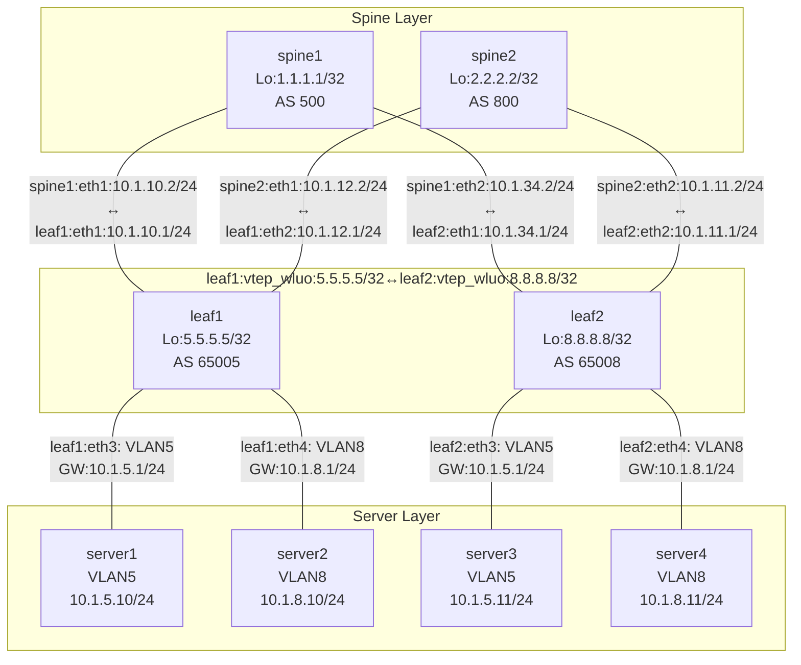

# SONiC BGP EVPN VxLAN

<div align="center">


</div>

# VxLAN BRIDGE FDB 
```shell
[leaf1]:
# vlan config:
sudo config vlan add 5
sudo config vlan member add -u 5 Ethernet8
sudo config vlan add 8
sudo config vlan member add -u 8 Ethernet12

# vxlan config:
sudo config vxlan add vtep_wluo 5.5.5.5
sudo config vxlan evpn_nvo add nvo_wluo vtep_wluo
sudo config vxlan map add vtep_wluo 5 5000
sudo config vxlan map add vtep_wluo 8 8000

# bridge "Bridge" bridge vlan interface and vxlan interface:
root@leaf1:~# brctl show 
bridge name     bridge id               STP enabled     interfaces
Bridge          8000.228b3ef51dd2       no              Ethernet12
                                                        Ethernet8
                                                        dummy
                                                        vtep_wluo-5
                                                        vtep_wluo-8
docker0         8000.024280a32037       no
root@leaf1:~# 

# bridge fdb show:
52:54:10:01:05:11 dev vtep_wluo-5 vlan 5 extern_learn master Bridge 
00:00:00:00:00:00 dev vtep_wluo-5 dst 8.8.8.8 self permanent
52:54:10:01:05:11 dev vtep_wluo-5 dst 8.8.8.8 self extern_learn 
52:54:10:01:08:11 dev vtep_wluo-8 vlan 8 extern_learn master Bridge 
00:00:00:00:00:00 dev vtep_wluo-8 dst 8.8.8.8 self permanent
52:54:10:01:08:11 dev vtep_wluo-8 dst 8.8.8.8 self extern_learn 
root@leaf1:~# 
# vxlan device:
root@leaf1:~# ip -d link show vtep_wluo-5
81: vtep_wluo-5: <BROADCAST,MULTICAST,UP,LOWER_UP> mtu 1500 qdisc noqueue master Bridge state UNKNOWN mode DEFAULT group default qlen 1000
    link/ether 22:8b:3e:f5:1d:d2 brd ff:ff:ff:ff:ff:ff promiscuity 1  allmulti 1 minmtu 68 maxmtu 65535 
    vxlan id 5000 local 5.5.5.5 srcport 0 0 dstport 4789 nolearning ttl auto ageing 300 udpcsum noudp6zerocsumtx noudp6zerocsumrx 
    bridge_slave state forwarding priority 32 cost 100 hairpin off guard off root_block off fastleave off learning off flood on port_id 0x8005 port_no 0x5 designated_port 32773 designated_cost 0 designated_bridge 8000.22:8b:3e:f5:1d:d2 designated_root 8000.22:8b:3e:f5:1d:d2 hold_timer    0.00 message_age_timer    0.00 forward_delay_timer    0.00 topology_change_ack 0 config_pending 0 proxy_arp off proxy_arp_wifi off mcast_router 1 mcast_fast_leave off mcast_flood on bcast_flood on mcast_to_unicast off neigh_suppress off group_fwd_mask 0 group_fwd_mask_str 0x0 vlan_tunnel off isolated off locked off addrgenmode eui64 numtxqueues 1 numrxqueues 1 gso_max_size 65536 gso_max_segs 65535 tso_max_size 65536 tso_max_segs 65535 gro_max_size 65536 
root@leaf1:~# ip -d link show vtep_wluo-8
82: vtep_wluo-8: <BROADCAST,MULTICAST,UP,LOWER_UP> mtu 1500 qdisc noqueue master Bridge state UNKNOWN mode DEFAULT group default qlen 1000
    link/ether 22:8b:3e:f5:1d:d2 brd ff:ff:ff:ff:ff:ff promiscuity 1  allmulti 1 minmtu 68 maxmtu 65535 
    vxlan id 8000 local 5.5.5.5 srcport 0 0 dstport 4789 nolearning ttl auto ageing 300 udpcsum noudp6zerocsumtx noudp6zerocsumrx 
    bridge_slave state forwarding priority 32 cost 100 hairpin off guard off root_block off fastleave off learning off flood on port_id 0x8006 port_no 0x6 designated_port 32774 designated_cost 0 designated_bridge 8000.22:8b:3e:f5:1d:d2 designated_root 8000.22:8b:3e:f5:1d:d2 hold_timer    0.00 message_age_timer    0.00 forward_delay_timer    0.00 topology_change_ack 0 config_pending 0 proxy_arp off proxy_arp_wifi off mcast_router 1 mcast_fast_leave off mcast_flood on bcast_flood on mcast_to_unicast off neigh_suppress off group_fwd_mask 0 group_fwd_mask_str 0x0 vlan_tunnel off isolated off locked off addrgenmode eui64 numtxqueues 1 numrxqueues 1 gso_max_size 65536 gso_max_segs 65535 tso_max_size 65536 tso_max_segs 65535 gro_max_size 65536 
root@leaf1:~# 
```