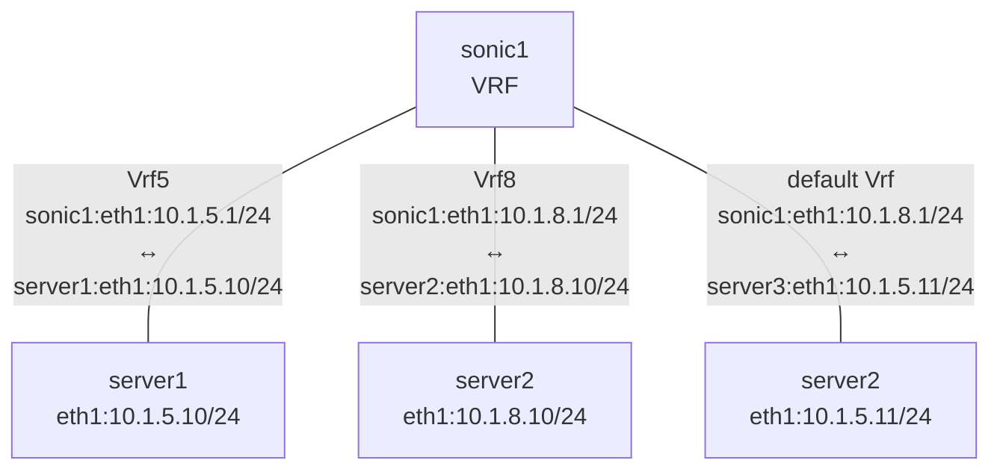

# SONiC VFR

```mermaid
graph TB
    %% nodes:
    sonic1["sonic1<br/>VRF"]

    server1["server1<br/>eth1:10.1.5.10/24"]
    server2["server2<br/>eth1:10.1.8.10/24"]
    server3["server2<br/>eth1:10.1.5.11/24"]
    
    %% links
    sonic1 --- |"Vrf5<br/>sonic1:eth1:10.1.5.1/24<br/>↔<br/>server1:eth1:10.1.5.10/24"| server1
    sonic1 --- |"Vrf8<br/>sonic1:eth1:10.1.8.1/24<br/>↔<br/>server2:eth1:10.1.8.10/24"| server2
    sonic1 --- |"default Vrf<br/>sonic1:eth1:10.1.8.1/24<br/>↔<br/>server3:eth1:10.1.5.11/24"| server3
```

