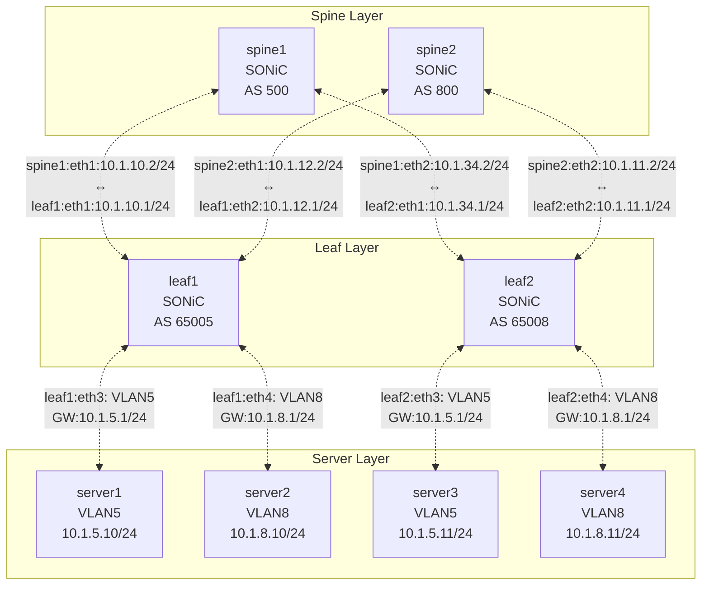

# SONiC BGP EVPN VxLAN

```mermaid
graph TB
    %% Nodes list
    subgraph "Spine Layer"
        S1["spine1<br/> SONiC<br/> AS 500"]
        S2["spine2<br/> SONiC<br/> AS 800"]
    end
    
    subgraph "Leaf Layer"
        L1["leaf1<br/> SONiC<br/> AS 65005"]
        L2["leaf2<br/> SONiC<br/> AS 65008"]
    end
    
    subgraph "Server Layer"
        H1["server1<br/>VLAN5<br/>10.1.5.10/24"]
        H2["server2<br/>VLAN8<br/>10.1.8.10/24"]
        H3["server3<br/>VLAN5<br/>10.1.5.11/24"]
        H4["server4<br/>VLAN8<br/>10.1.8.11/24"]
    end
    
    %% Underlay links
    S1 <-.->|"spine1:eth1:10.1.10.2/24<br/>↔<br/>leaf1:eth1:10.1.10.1/24"| L1
    S1 <-.->|"spine1:eth2:10.1.34.2/24<br/>↔<br/>leaf2:eth1:10.1.34.1/24"| L2
    S2 <-.->|"spine2:eth1:10.1.12.2/24<br/>↔<br/>leaf1:eth2:10.1.12.1/24"| L1
    S2 <-.->|"spine2:eth2:10.1.11.2/24<br/>↔<br/>leaf2:eth2:10.1.11.1/24"| L2
    
    %% Access links
    L1 <-.->|"leaf1:eth3: VLAN5<br/>GW:10.1.5.1/24"| H1
    L1 <-.->|"leaf1:eth4: VLAN8<br/>GW:10.1.8.1/24"| H2
    L2 <-.->|"leaf2:eth3: VLAN5<br/>GW:10.1.5.1/24"| H3
    L2 <-.->|"leaf2:eth4: VLAN8<br/>GW:10.1.8.1/24"| H4
```

