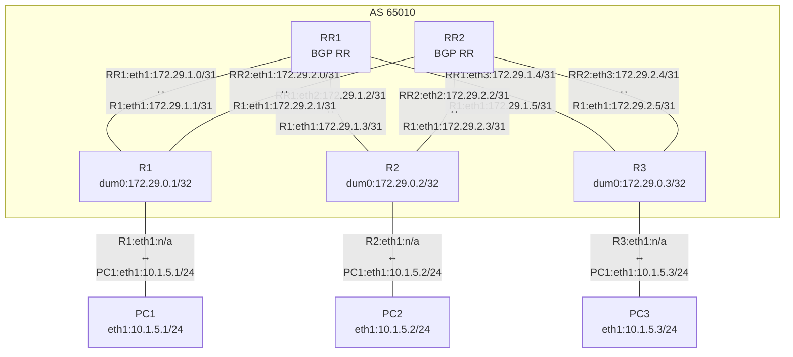

# VyOS VXLAN BGP EVPN

<div align="center">


</div>

```shell
# R1 VXLAN config:
set interfaces vxlan vxlan100 parameters nolearning
set interfaces vxlan vxlan100 port '4789'
set interfaces vxlan vxlan100 source-address '172.29.0.1'
set interfaces vxlan vxlan100 vni '100'

set interfaces bridge br100 member interface eth3
set interfaces bridge br100 member interface vxlan100
```