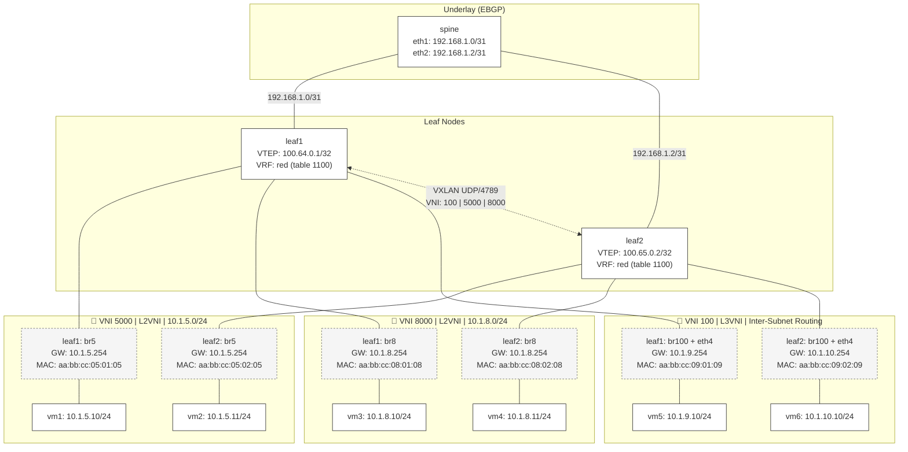

```mermaid
graph TB
    classDef device fill:#fff,stroke:#333,stroke-width:1px
    classDef vni fill:#f5f5f5,stroke:#666,stroke-width:1px,stroke-dasharray:3 3

    %% Underlay
    subgraph Underlay ["Underlay (EBGP)"]
        spine["spine<br/>eth1: 192.168.1.0/31<br/>eth2: 192.168.1.2/31"]:::device
    end

    %% Leaf Nodes
    subgraph Leaf_Nodes ["Leaf Nodes"]
        leaf1["leaf1<br/>VTEP: 100.64.0.1/32<br/>VRF: red (table 1100)"]:::device
        leaf2["leaf2<br/>VTEP: 100.65.0.2/32<br/>VRF: red (table 1100)"]:::device
    end

    %% VNI 5000 - Subnet 10.1.5.0/24
    subgraph VNI_5000 ["🔹 VNI 5000 | L2VNI | 10.1.5.0/24"]
        direction TB
        br5_l1["leaf1: br5<br/>GW: 10.1.5.254<br/>MAC: aa:bb:cc:05:01:05"]:::vni
        br5_l2["leaf2: br5<br/>GW: 10.1.5.254<br/>MAC: aa:bb:cc:05:02:05"]:::vni
        vm1["vm1: 10.1.5.10/24"]:::device
        vm2["vm2: 10.1.5.11/24"]:::device
    end

    %% VNI 8000 - Subnet 10.1.8.0/24
    subgraph VNI_8000 ["🔹 VNI 8000 | L2VNI | 10.1.8.0/24"]
        direction TB
        br8_l1["leaf1: br8<br/>GW: 10.1.8.254<br/>MAC: aa:bb:cc:08:01:08"]:::vni
        br8_l2["leaf2: br8<br/>GW: 10.1.8.254<br/>MAC: aa:bb:cc:08:02:08"]:::vni
        vm3["vm3: 10.1.8.10/24"]:::device
        vm4["vm4: 10.1.8.11/24"]:::device
    end

    %% VNI 100 - L3VNI for Inter-Subnet
    subgraph VNI_100 ["🔹 VNI 100 | L3VNI | Inter-Subnet Routing"]
        direction TB
        br100_l1["leaf1: br100 + eth4<br/>GW: 10.1.9.254<br/>MAC: aa:bb:cc:09:01:09"]:::vni
        br100_l2["leaf2: br100 + eth4<br/>GW: 10.1.10.254<br/>MAC: aa:bb:cc:09:02:09"]:::vni
        vm5["vm5: 10.1.9.10/24"]:::device
        vm6["vm6: 10.1.10.10/24"]:::device
    end

    %% Links - Underlay
    spine ---|"192.168.1.0/31"| leaf1
    spine ---|"192.168.1.2/31"| leaf2

    %% Links - VNI 5000
    leaf1 --- br5_l1
    leaf2 --- br5_l2
    br5_l1 --- vm1
    br5_l2 --- vm2

    %% Links - VNI 8000
    leaf1 --- br8_l1
    leaf2 --- br8_l2
    br8_l1 --- vm3
    br8_l2 --- vm4

    %% Links - VNI 100
    leaf1 --- br100_l1
    leaf2 --- br100_l2
    br100_l1 --- vm5
    br100_l2 --- vm6

    %% VXLAN Tunnel (logical)
    leaf1 <-.->|"VXLAN UDP/4789<br/>VNI: 100 | 5000 | 8000"| leaf2
```

