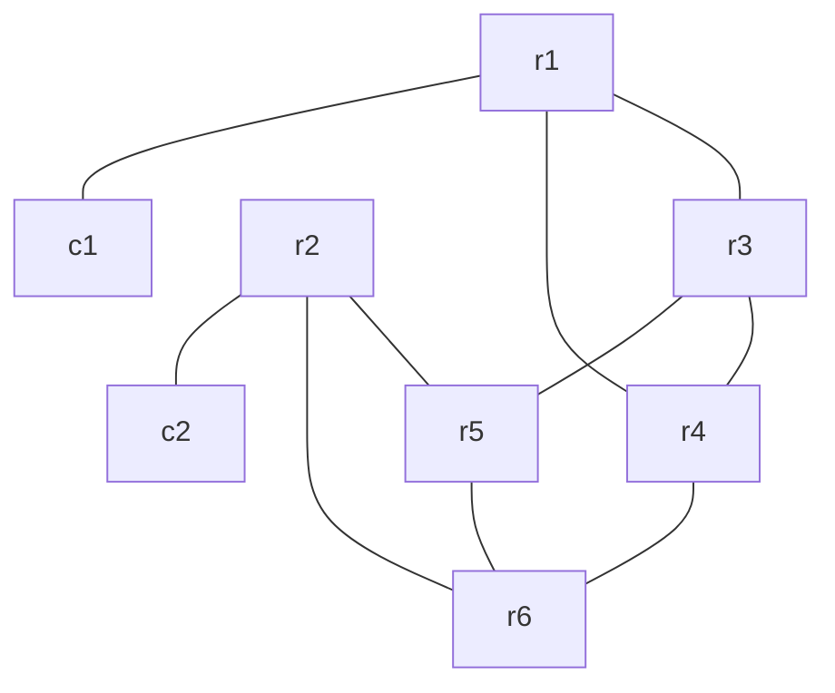

# clab-frr-srv6

## Overview

A Segment Routing IPv6 (SRv6) network using [CONTAINERlab](https://containerlab.dev/) and [FRRouting (FRR)](https://frrouting.org/) nodes to demonstrate [SRv6](https://docs.frrouting.org/en/latest/zebra.html#segment-routing-ipv6) capabilities in a controlled lab environment. This lab provides a practical environment for learning and testing basic SRv6 concepts, including locator blocks, SRv6 transport for BGP L3VPN services, and SRv6 functions and behaviors.

## Requirements

- [CONTAINERlab](https://containerlab.dev/install/)
  - _The [CONTAINERlab](https://containerlab.dev/install/) installation guide outlines various installation methods. This lab assumes all [pre-requisites](https://containerlab.dev/install/#pre-requisites) (including Docker) are met and CONTAINERlab is installed via the [install script](https://containerlab.dev/install/#install-script)._
- Docker FRR image: `quay.io/frrouting/frr:master` (will be downloaded automatically)
- Docker Network Multitool image: `wbitt/network-multitool:alpine-extra` (for client nodes) (will be downloaded automatically)

## Topology



## Network Resources

- The IPv4 loopback addresses of nodes r1 to r6 follow the format:
  - x.x.x.x/32 for router rx (e.g., 1.1.1.1/32 for r1)
- The IPv6 loopback addresses is derived from the SRv6 locator block
  - 2001:db8:x::1/128 for SRv6 locator on router rx (e.g., 2001:db8:1::1/128 for r1)
- The interface addresses are IPv6 and follow the format:
  - 2001:c0de:1:y::z/64 where y and z vary per link
- All routers are part of ISIS Level 2 with IS-IS NET addresses following the format 49.0001.0000.0000.000x.00
- BGP is configured on the PEs (r1 and r2) with ASN 65000
- SRv6 is configured with:
  - Locator blocks using 2001:db8:x::/48 prefix
  - USID format (micro-segment) with block-len 32, node-len 16, func-bits 16

### Management Network

The following IP addresses are assigned to the containerLAB nodes for management:

| Node      | Management IP   |
|-----------|----------------|
| r1        | 172.28.1.2/24  |
| r2        | 172.28.1.3/24  |
| r3        | 172.28.1.4/24  |
| r4        | 172.28.1.5/24  |
| r5        | 172.28.1.6/24  |
| r6        | 172.28.1.7/24  |
| c1        | 172.28.1.8/24  |
| c2        | 172.28.1.9/24  |
| promtail  | 172.28.1.10/24 |
| loki      | 172.28.1.11/24 |
| grafana   | 172.28.1.12/24 |

## SRv6-based L3VPN Services

This lab demonstrates SRv6 as a transport for L3VPN services, showcasing how SRv6 can replace traditional MPLS-based VPN implementations:

### SRv6 Setup

- **SRv6 Locators**: Each router (r1-r6) has a unique SRv6 locator block (2001:db8:x::/48) that serves as the foundation for SRv6 functions
- **uSID Format**: The lab uses micro-segment identifiers (uSID) with block-len 32, node-len 16, func-bits 16 format for efficient segment encoding
- **SRv6 Encapsulation Behavior**: The main BGP process includes `segment-routing srv6` with `locator Loc0` and `encap-behavior H_Encaps_Red` configuration, which defines how VPN traffic is encapsulated into SRv6 packets. The H_Encaps_Red behavior specifically indicates that the router performs SRv6 header encapsulation with reduced SRH (Segment Routing Header) for VPN traffic
- **VPN SID Generation**: PE routers (r1 and r2) use `sid vpn per-vrf export auto` under each BGP VRF process to automatically generate SRv6 SIDs for VPN services

### BGP L3VPN Setup

- **VRF Configuration**: The RED VRF is configured on both PE routers (r1 and r2) for IPv4 and IPv6 address families. The BLUE VRF is also configured on both PE routers (r1 and r2) for the IPv4 address family.
- **Client Connectivity**: Clients c1 and c2 connect to r1 and r2 respectively through VLAN interfaces assigned to the RED VRF or BLUE VRF.
- **Route Distinguishers**: VRF routes use router-specific RDs and share the same RT, one per VRF.
- **End-to-End Service**: The BGP L3VPN control plane exchanges routes between the VRFs, while SRv6 provides the data plane transport across the network

## Monitoring

A logging stack is deployed to collect and aggregate logs from the FRR routers and clients. The logging stack is deployed using [CONTAINERlab](https://containerlab.dev/), [Promtail](https://grafana.com/docs/loki/latest/clients/promtail/), [Loki](https://grafana.com/docs/loki/latest/), and [Grafana](https://grafana.com/).

Once the lab is deployed, the logging stack can be accessed at `http://localhost:3000`. Then navigate to the `Network Logs` dashboard.

## Deployment

Clone this repository and start the lab:

```shell
git clone https://github.com/dbono711/clab-frr-srv6.git
cd clab-frr-srv6
sudo clab deploy -t lab.yml
```

**_NOTE: CONTAINERlab requires SUDO privileges in order to execute_**

The deployment process:

- Creates the [CONTAINERlab network](lab.yml) based on the topology definition
- Applies the FRR configuration files from the respective router folders on each node
- Executes the initialization scripts for each router and client

## Accessing the Container Shell

The container shell can be accessed by using the `docker exec` command, as follows:

```shell
docker exec -it <container> bash
```

For example, to access the shell on the `r1` FRR container:

```shell
docker exec -it clab-frr-srv6-r1 bash
```

## Accessing the FRR CLI (vtysh)

The FRR CLI can be accessed by using the `docker exec` command, as follows:

```shell
docker exec -it <container> vtysh
```

For example, to access the FRR CLI on the `r1` container:

```shell
docker exec -it clab-frr-srv6-r1 vtysh
```

## Capturing Packets

Here is an example on how to capture packets directly on the host which CONTAINERlab is running:

```shell
sudo ip netns exec clab-frr-srv6-r1 tcpdump -nni eth1
```

## Cleanup

Stop the lab and tear down the CONTAINERlab containers:

```shell
clab destroy -t lab.yml
```

## Author

- Darren Bono - [darren.bono@att.net](mailto://darren.bono@att.net)

## License

This project is licensed under the MIT License. See [LICENSE](LICENSE) for details
