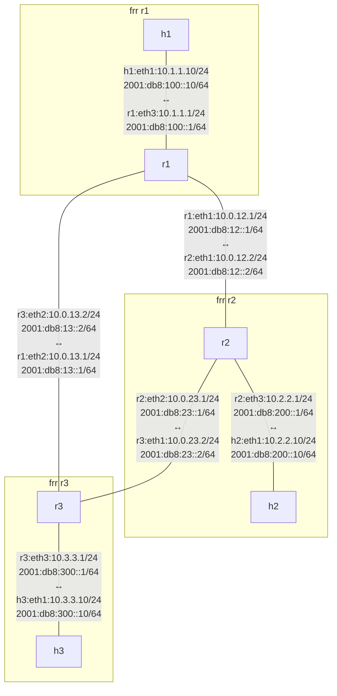

# FRR OSPF and OSPF6

```mermaid
graph TB
    subgraph "frr r1"
        R1["r1"]
        H1["h1"]
        H1 --- |"h1:eth1:10.1.1.10/24<br/>2001:db8:100::10/64<br/>↔<br/>r1:eth3:10.1.1.1/24<br/>2001:db8:100::1/64"| R1    
    end
    
    subgraph "frr r2"
        R2["r2"]
        H2["h2"]
        R2 --- |"r2:eth3:10.2.2.1/24<br/>2001:db8:200::1/64<br/>↔<br/>h2:eth1:10.2.2.10/24<br/>2001:db8:200::10/64"| H2
    end
    
    subgraph "frr r3"
        R3["r3"]
        H3["h3"]
        R3 --- |"r3:eth3:10.3.3.1/24<br/>2001:db8:300::1/64<br/>↔<br/>h3:eth1:10.3.3.10/24<br/>2001:db8:300::10/64"| H3
    end
    
    R1 --- |"r1:eth1:10.0.12.1/24<br/>2001:db8:12::1/64<br/>↔<br/>r2:eth1:10.0.12.2/24<br/>2001:db8:12::2/64"| R2
    R2 --- |"r2:eth2:10.0.23.1/24<br/>2001:db8:23::1/64<br/>↔<br/>r3:eth1:10.0.23.2/24<br/>2001:db8:23::2/64"| R3
    R3 --- |"r3:eth2:10.0.13.2/24<br/>2001:db8:13::2/64<br/>↔<br/>r1:eth2:10.0.13.1/24<br/>2001:db8:13::1/64"| R1
```

