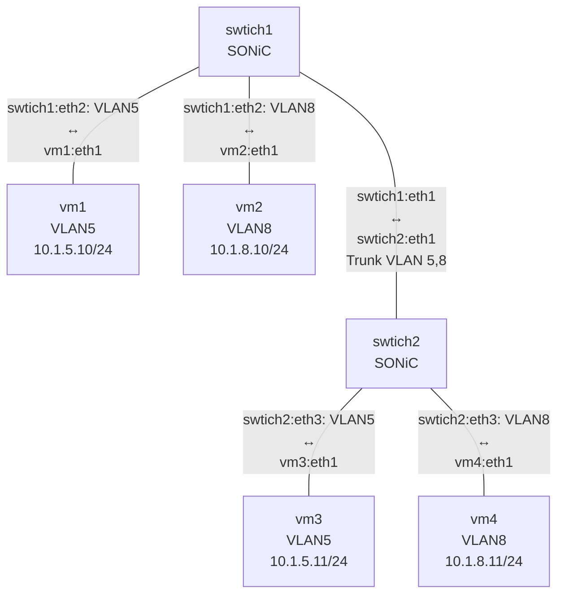

# SONiC VLAN

```mermaid
graph TB
    swtich1["swtich1<br/> SONiC"]
    swtich2["swtich2<br/> SONiC"]
    
    H1["vm1<br/>VLAN5<br/>10.1.5.10/24"]
    H2["vm2<br/>VLAN8<br/>10.1.8.10/24"]
    H3["vm3<br/>VLAN5<br/>10.1.5.11/24"]
    H4["vm4<br/>VLAN8<br/>10.1.8.11/24"]
    
    swtich1 ---- |"swtich1:eth1<br/>↔<br/>swtich2:eth1<br/>Trunk VLAN 5,8"| swtich2

    swtich1 --- |"swtich1:eth2: VLAN5<br/>↔<br/>vm1:eth1"| H1
    swtich1 --- |"swtich1:eth2: VLAN8<br/>↔<br/>vm2:eth1"| H2
    swtich2 --- |"swtich2:eth3: VLAN5<br/>↔<br/>vm3:eth1"| H3
    swtich2 --- |"swtich2:eth3: VLAN8<br/>↔<br/>vm4:eth1"| H4
```

