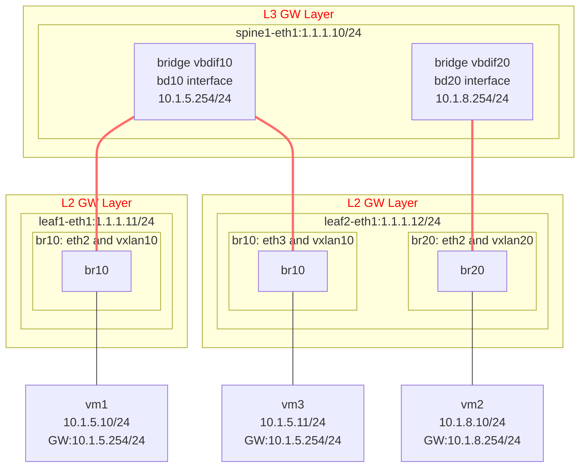

# FRR VXLAN BGP EVPN Centralized-Gateway

```mermaid
graph TB
    %% Nodes list
    subgraph "<font color='red'>L3 GW Layer</font>"
        subgraph "spine1-eth1:1.1.1.10/24"
            vbdif10["bridge vbdif10<br/>bd10 interface<br/>10.1.5.254/24"]
            vbdif20["bridge vbdif20<br/>bd20 interface<br/>10.1.8.254/24"]
        end
    end

    subgraph "<font color='red'>L2 GW Layer</font>"
        subgraph "leaf1-eth1:1.1.1.11/24"
            subgraph "br10: eth2 and vxlan10"
                leaf1-br10["br10"]
            end
        end
    end
    
    subgraph "<font color='red'>L2 GW Layer</font>"
        subgraph "leaf2-eth1:1.1.1.12/24"
            subgraph "br20: eth2 and vxlan20"
                leaf2-br20["br20"]
            end
            subgraph "br10: eth3 and vxlan10"
                leaf2-br10["br10"]
            end        
        end
    end

    vm1["vm1<br/>10.1.5.10/24<br/>GW:10.1.5.254/24"]
    vm2["vm2<br/>10.1.8.10/24<br/>GW:10.1.8.254/24"]
    vm3["vm3<br/>10.1.5.11/24<br/>GW:10.1.5.254/24"]
    
    %% links
    vbdif10 --- leaf1-br10
    vbdif20 --- leaf2-br20   
    vbdif10 --- leaf2-br10 

    leaf1-br10 --- vm1
    leaf2-br10 --- vm3
    leaf2-br20 --- vm2

    linkStyle 0 stroke:#ff6b6b,stroke-width:3px,color:#ff6b6b
    linkStyle 1 stroke:#ff6b6b,stroke-width:3px,color:#ff6b6b
    linkStyle 2 stroke:#ff6b6b,stroke-width:3px,color:#ff6b6b

```

