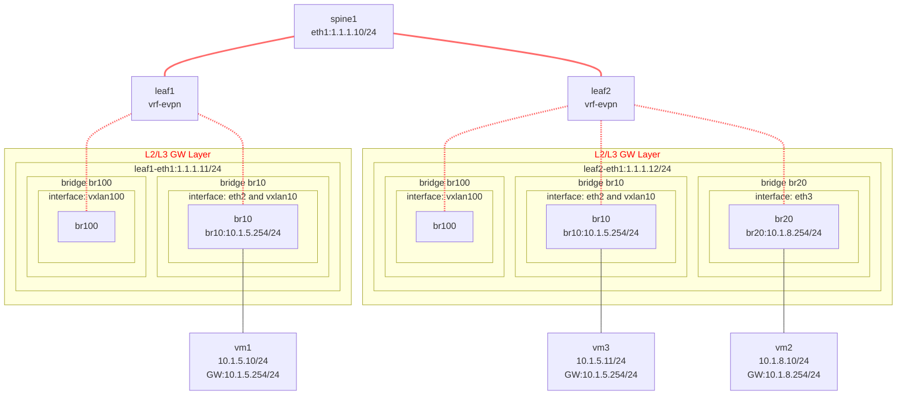

# FRR VXLAN BGP EVPN Distributed-Gateway

<div align="center">


</div>


```shell
入包 → br10 → vlan10 (SVI) → evpn-vrf → 路由表
    ↓ 查找 10.1.8.0/24 路由
    ↓ 路由指向 br100（因为 br100 在 VRF 中）###[B>* 10.1.8.0/24 [20/0] via 1.1.1.12, br100 onlink, weight 1, 00:01:24]
    ↓ br100 查找 MAC 表，从 vxlan100 发出
    ↓ 封装 VNI=100
leaf1# show ip route vrf evpn-vrf 
Codes: K - kernel route, C - connected, L - local, S - static,
       R - RIP, O - OSPF, I - IS-IS, B - BGP, E - EIGRP, N - NHRP,
       T - Table, v - VNC, V - VNC-Direct, A - Babel, F - PBR,
       f - OpenFabric, t - Table-Direct,
       > - selected route, * - FIB route, q - queued, r - rejected, b - backup
       t - trapped, o - offload failure

IPv4 unicast VRF evpn-vrf:
C>* 10.1.5.0/24 is directly connected, br10, weight 1, 00:01:24
L * 10.1.5.254/32 is directly connected, br10, weight 1, 00:01:24
L>* 10.1.5.254/32 is directly connected, br10, weight 1, 00:01:24
B>* 10.1.8.0/24 [20/0] via 1.1.1.12, br100 onlink, weight 1, 00:01:24
leaf1# 
```