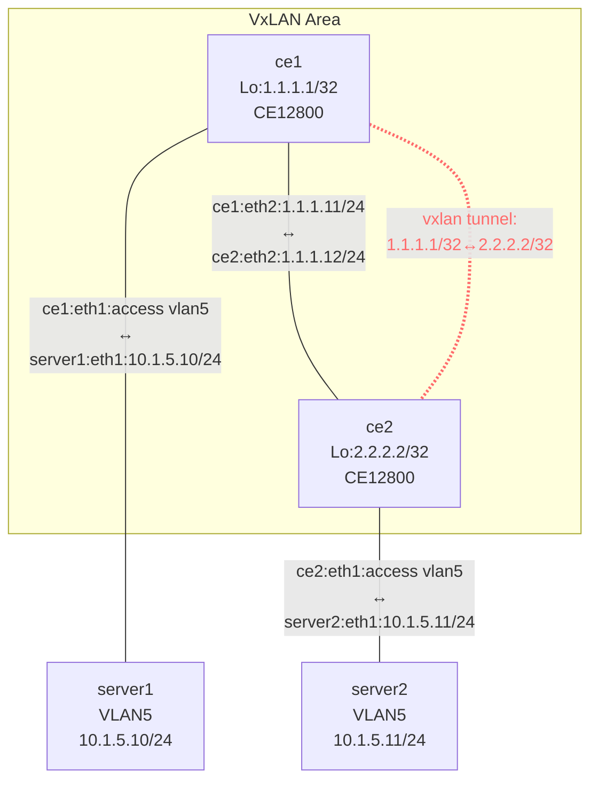

# HUAWEI VxLAN

```mermaid
graph TB
    %% Nodes list
    subgraph "VxLAN Area"
        ce1["ce1<br/>Lo:1.1.1.1/32<br/>CE12800"]
        ce2["ce2<br/>Lo:2.2.2.2/32<br/>CE12800"]
    end

    server1["server1<br/>VLAN5<br/>10.1.5.10/24"]
    server2["server2<br/>VLAN5<br/>10.1.5.11/24"]
    
    %% links
    ce2 --- |"ce2:eth1:access vlan5<br/>↔<br/>server2:eth1:10.1.5.11/24"| server2
    ce1 ----- |"ce1:eth1:access vlan5<br/>↔<br/>server1:eth1:10.1.5.10/24"| server1
    ce1 --- |"ce1:eth2:1.1.1.11/24<br/>↔<br/>ce2:eth2:1.1.1.12/24"| ce2
    ce1 -..- |"vxlan tunnel:<br/>1.1.1.1/32↔2.2.2.2/32"| ce2

    linkStyle 3 stroke:#ff6b6b,stroke-width:3px,color:#ff6b6b

```

